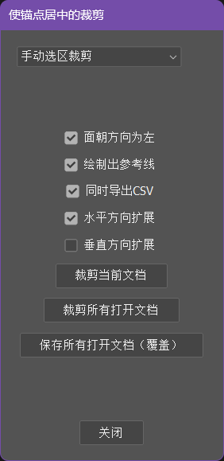
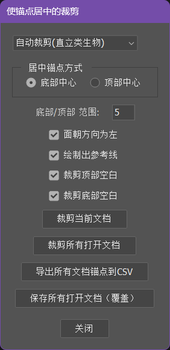
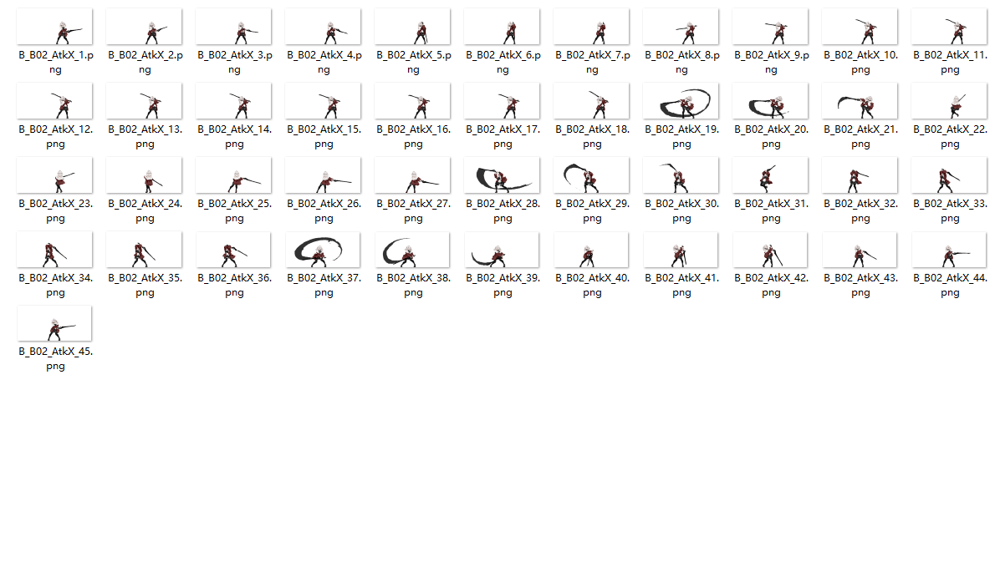
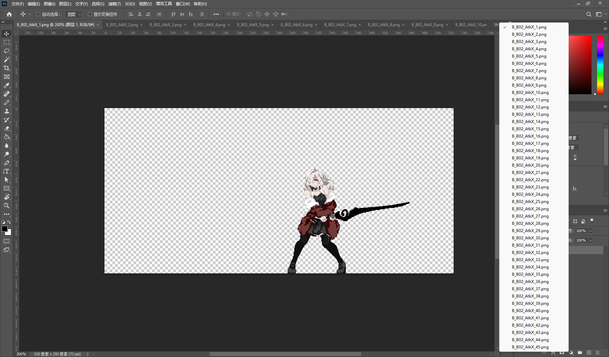
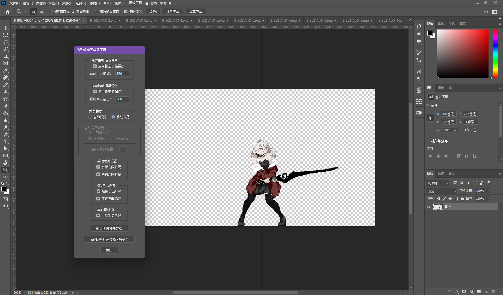

# SpriteSequenceCropper

一个 Photoshop（PS） 脚本，主要解决游戏开发中 2D 序列帧图片的裁剪, 计算锚点偏移等批量处理需求。该脚本提供应对万能情况的手动框选和专为人类或类人形生物设计的自动裁剪两种模式，可以将角色图片裁剪从而保持锚点居中，同时可以导出相邻序列帧之间的锚点偏移。该数据专为游戏引擎（Unity/UE）中导入统一锚点的 Sprite 设计，可以利用其在程序中实现更精确的动画位移，保持与原帧动画一致，实现原汁原味的表现

由于是在游戏引擎中使用的 sprite，所以图片拥有并且要求有以下特点：

- .png 格式
- 图像模式为“RGB颜色”
- （可选）对批量保存的要求是一个文档只有一个合并后的图层，否则请手动保存

# 使用说明
### 安装方法

1. 下载脚本
2. 在 Photoshop 中运行：
  - 选择“文件” -> “脚本” -> “浏览...”
  - 找到并选择下载的脚本文件载入

### 功能及参数说明

下拉框提供了两种模式的切换：

- `手动选区裁剪`：应对任何情况的万能模式。手动框选目标的碰撞盒区域进行智能裁剪
- `自动裁剪(直立类生物)`：专为人类或类人形生物设计的自动裁剪模式

**手动选区裁剪**

- `面朝方向为左`：角色是否面朝左边，不勾选代表则代表面向右侧。根据角色的左右朝向会决定写入CSV文件中偏移值的正负，保证偏移值的正始终代表着角色的“正面”前进方向，负代表角色的“背后”后退方向
- `绘制出参考线`：是否绘制辅助参考线（仅在PS中作为视觉参考并不影响图片以及导出的任何数据）
- `同时导出CSV`：裁剪时，是否导出锚点坐标数据及偏移数据到 .csv 文件
- `水平方向扩展`：横向扩展，勾选后会以选区中心在水平方向扩展保证保留图片左右最小边界的前提下左右对称，即保证碰撞盒与选区在水平方向完全一致。否则将忽略水平方向是否对称，仅进行保留图片左右最小边界的裁剪
- `垂直方向扩展`：纵向扩展，勾选后会以选区中心在垂直方向扩展保证保留图片上下最小边界的前提下上下对称，即保证碰撞盒与选区在垂直方向完全一致。否则将忽略垂直方向是否对称，仅进行保留图片上下最小边界的裁剪
- `裁剪当前文档`：对当前文档的活跃图层进行裁剪从而保持锚点居中
- `裁剪所有打开文档`：对所有打开文档的活跃图层进行裁剪从而保持锚点居中
- `保存所有打开文档（覆盖）`：以覆盖保存的方式保存所有打开文档（建议配合“裁剪所有打开文档”使用）

*****

**自动裁剪(直立类生物)**

- `居中锚点方式`：指裁剪后图片锚点的居中方式，包括“底部中心”和“顶部中心”，“底部中心”为锚点保持在角色脚部中心，“顶部中心”为锚点保持在角色头顶中心
- `底部/顶部 范围`：锚点会保持在角色的顶部/底部中心，该值是指要识别的角色头部（顶部）/脚部（底部）的距图片上/下边界的纵向范围
- `面朝方向为左`：角色是否面朝左边，不勾选代表则代表面向右侧。根据角色的左右朝向会决定写入CSV文件中偏移值的正负，保证偏移值的正始终代表着角色的“正面”前进方向，负代表角色的“背后”后退方向
- `绘制出参考线`：是否绘制辅助参考线（仅在PS中作为视觉参考并不影响图片以及导出的任何数据）
- `对顶部裁剪`：是否裁剪图片顶部的空白部分
- `对底部裁剪`：是否裁剪图片底部的空白部分
- `裁剪当前文档`：对当前文档的活跃图层进行裁剪从而保持锚点居中
- `裁剪所有打开文档`：对所有打开文档的活跃图层进行裁剪从而保持锚点居中
- `导出所有文档锚点到CSV`：将打开的所有文档的中心锚点坐标导出到 .csv 文件。主要用于对已裁剪好的图片，批量记录他们的中心坐标时使用
- `保存所有打开文档（覆盖）`：以覆盖保存的方式保存所有打开文档（建议配合“裁剪所有打开文档”使用）

### 输出 CSV 文件说明

启用“同时导出CSV”时，会在选择的文件夹路径下生成 `offsets.csv` 文件：

|文件名|中心点X|中心点Y|偏移量X|偏移量Y|
|  ----  | ----  |  ----  | ----  |
|sprite1.png | 256 | 128 | 0 | 0 |
|sprite2.png | 255 | 129 | -1 | 1 |
|sprite3.png | 253 | 129 | -2 | 0 |

每一行数据分别对应一张帧图片的信息：

- `文件名`：图片的文件名
- `中心点X`：裁剪后图片的中心锚点在原图中的横坐标（以原图左上角为坐标原点）
- `中心点Y`：裁剪后图片的中心锚点在原图中的纵坐标（以原图左上角为坐标原点）
- `偏移量X`：裁剪后图片的中心锚点在原图中的横坐标相对于上一张图片的偏移量（正数代表向角色的“前面”前进的偏移量，负数代表向“后面”后退的偏移量，角色的“前后”由“面朝方向为左”开关设置）
- `偏移量Y`：裁剪后图片的中心锚点在原图中的纵坐标相对于上一张图片的偏移量（正数代表向角色的“前面”前进的偏移量，负数代表向“后面”后退的偏移量，角色的“前后”由“面朝方向为左”开关设置）

### 使用示例参考

#### 手动选区裁剪示例

现在有一组动画序列帧，该序列帧动画自带动画位移，需要处理为锚点居中的图像，同时输出锚点偏移用于导入游戏引擎后为程序使用，在程序中实现动画位移

1. 打开 PS ，将所有图片打开（注意需要按照序列帧的顺序打开，保证偏移的计算正确性）

2. 手动为每一帧选择碰撞盒的大致选区，所有帧的选区选择完毕后**将第一帧切换为活动文档**

3. 打开脚本窗口，对可选参数进行设置，此时由于默认参数已经满足该需求所以不进行变动，点击“裁剪所有打开文档”，选择要导出的 .csv 文件保存路径

4. 裁剪后，再点击“保存所有裁剪打开文档（覆盖）”，处理完毕

5. 查看 .csv 文件如下

*****

#### 自动裁剪(直立类生物)示例

现在有一批需要处理为锚点居中在底部的图像

1. 打开 PS ，将所有图片打开，并打开脚本窗口

2. 对可选参数进行设置，此时由于默认参数已经满足该需求所以不进行变动，点击“裁剪所有打开文档”

3. 裁剪后，再点击“保存所有裁剪打开文档（覆盖）”，处理完毕，现在所有图片的锚点都位于角色的底部中心

